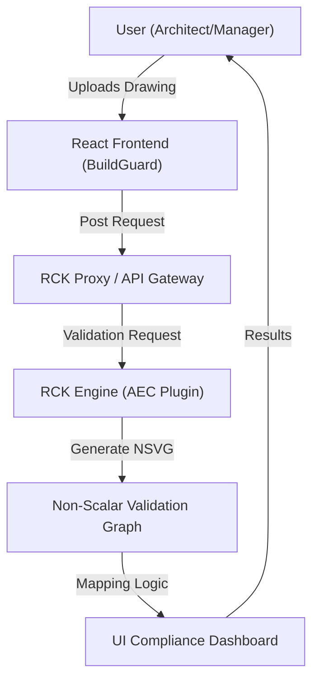

# Technical Architecture

BuildGuard is designed to be a thin, highly interactive frontend that offloads complex structural and regulatory validation to the RCK Engine.

## Tech Stack

- **Frontend**: Vite + React (TypeScript)
- **Styling**: Vanilla CSS (Premium Custom Design) + Framer Motion (Animations)
- **Icons**: Lucide React
- **API Client**: Axios
- **AI Layer**: RCK Engine (FastAPI / NSVG Backend)

## Data Flow Architecture

## System Components

### 1. BuildGuard UI
A dashboard-driven interface focusing on clarity and risk visualization. It uses **Framer Motion** for smooth transitions between "Safe" and "Warning" states.

### 2. RCK Engine (AI Core)
The engine consumes drawings and applies the `aec-drawings-v1` plugin. It doesn't just "predict" safety; it calculates it based on hard geometric and regulatory constraints within the NSVG.

### 3. NSVG Mapping Layer
This layer transforms complex graph data from RCK into digestible UI components:
- **Nodes**: Specific points of interest in a drawing.
- **Edges**: Relationships between components (e.g., Distance between fire exit and workstations).
- **Validation Markers**: Boolean results (Pass/Fail) or risk scores.
